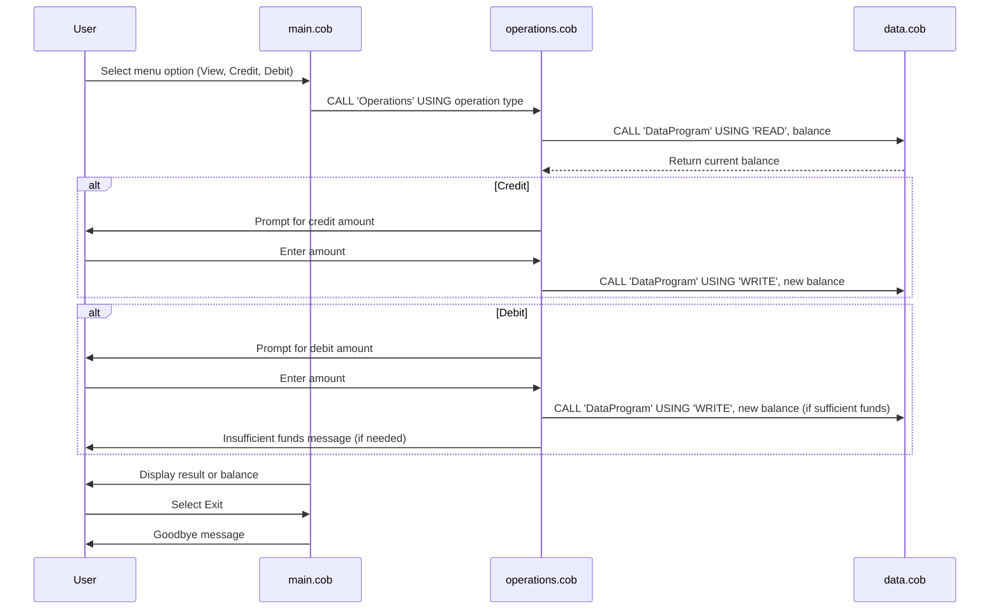

# COBOL Student Account Management System

This project demonstrates a simple legacy COBOL application for managing student accounts. The system allows users to view balances, credit, and debit accounts, simulating basic banking operations for student accounts.

## Purpose of Each COBOL File

### `main.cob`

- **Purpose:** Entry point and main control program for the account management system.

- **Key Functions:**
  - Presents a menu to the user with options to view balance, credit, debit, or exit.
  - Accepts user input and calls the `Operations` program with the selected operation type.
  - Loops until the user chooses to exit.

- **Business Rules:**
  - Only allows valid menu choices (1-4).
  - Exits cleanly with a goodbye message.

### `operations.cob`

- **Purpose:** Handles the core business logic for account operations.

- **Key Functions:**
  - Receives the operation type (`TOTAL`, `CREDIT`, `DEBIT`) from `main.cob`.
  - For `TOTAL`, reads and displays the current balance.
  - For `CREDIT`, prompts for an amount, adds it to the balance, and updates storage.
  - For `DEBIT`, prompts for an amount, checks for sufficient funds, subtracts from the balance if possible, and updates storage.

- **Business Rules:**
  - Prevents debiting more than the available balance (no overdraft allowed).
  - All balance changes are persisted via the `DataProgram`.

### `data.cob`

- **Purpose:** Manages persistent storage of the account balance.

- **Key Functions:**
  - Receives operation type (`READ` or `WRITE`) and a balance value.
  - For `READ`, returns the current stored balance.
  - For `WRITE`, updates the stored balance with the provided value.

- **Business Rules:**
  - All balance reads and writes are centralized here, ensuring data consistency.

## Business Rules Summary

- Only valid menu options are accepted.
- Credits and debits update the balance through a controlled process.
- Debits are only allowed if sufficient funds exist.
- All balance changes are persisted and managed through a dedicated data program.

---

For more details, see the source code in `/src/cobol/`.

---

## Sequence Diagram: Data Flow

